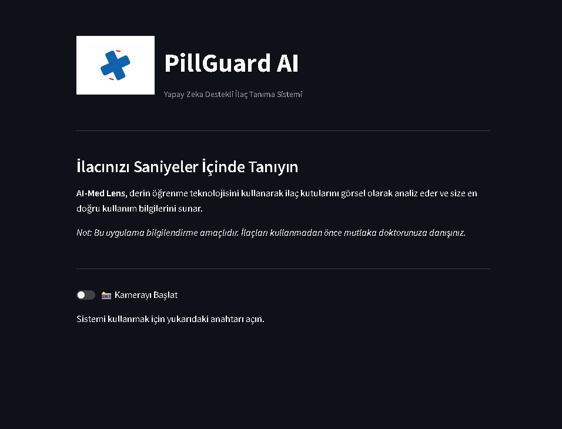

# 💊 PillGuard AI: Akıllı İlaç Analiz Sistemi

PillGuard AI, derin öğrenme teknolojisi kullanarak ilaç kutularını görsel olarak analiz eden ve kullanıcıya ilaç hakkında temel bilgiler sunan bir web uygulamasıdır.

## 🚀 Özellikler
- **Yapay Zeka Destekli:** MobileNetV2 tabanlı derin öğrenme modeli.
- **Canlı Analiz:** Kamera üzerinden anlık fotoğraf çekimi ve tahmin.
- **Modern Arayüz:** Streamlit ve Lottie animasyonları ile zenginleştirilmiş kullanıcı deneyimi.
- **Bilgi Bankası:** İlaçların kullanım amacı, yan etkileri ve etken maddeleri.

## 🛠️ Kurulum

1. Bu projeyi bilgisayarınıza indirin veya klonlayın.
2. Gerekli kütüphaneleri yükleyin:
   ```bash
   pip install -r requirements.txt
   
   Uygulamayı başlatın:
streamlit run app.py

🧠 Kullanılan Teknolojiler
Python (Dil)

TensorFlow / Keras (Derin Öğrenme)

Streamlit (Web Arayüzü)

Lottie (Animasyonlar)

Not: Bu uygulama sadece bilgilendirme amaçlıdır. İlaç kullanımında her zaman bir uzmana danışılmalıdır.
